## Conexion PAC3120 con Python

## Requerimientos 
Primero instalar librerías para manejo de Modbus:

`python -m pip install pymodbus`

`python -m pip install pyModbusTCP`

`python -m pip install minimalmodbus`

Segundo instalar librerías para manejo de menú de consola:

`pip install keyboard`

## Resumen

En este documento se hallan las instrucciones para el correcto uso del software Modbus Slave y los archivos de Python para configurar una conexión directa y obtener resultados derivados del medidor PAC3120 simulado dentro de Modbus Slave. 

## Conexión con Modbus Slave. 

Para comenzar abrimos tres ventanas del programa Modbus Slave y en todas ellas se da clic en display, que está ubicado en la barra de herramientas superior, y configuramos todas las ventanas en float, como se muestra en la siguiente imagen: 

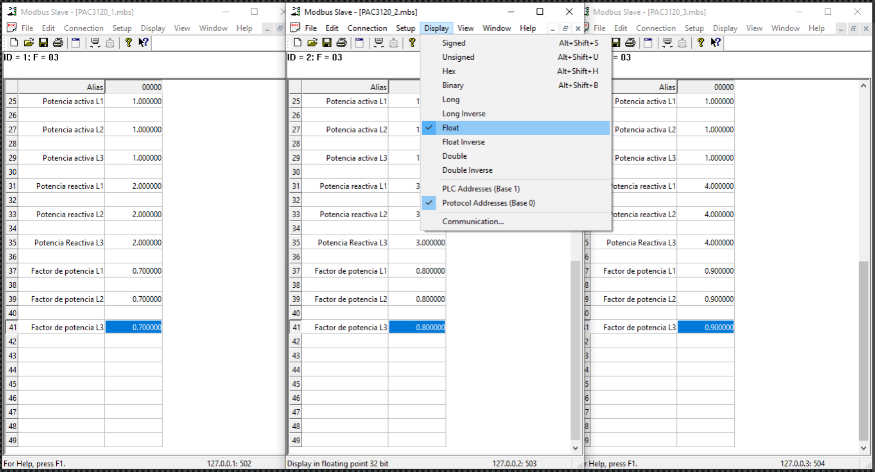

Después, podemos ingresar valores para simular la entrada de datos que recibiría en equipo cuando está conectado de manera física, como se muestra a continuación: 

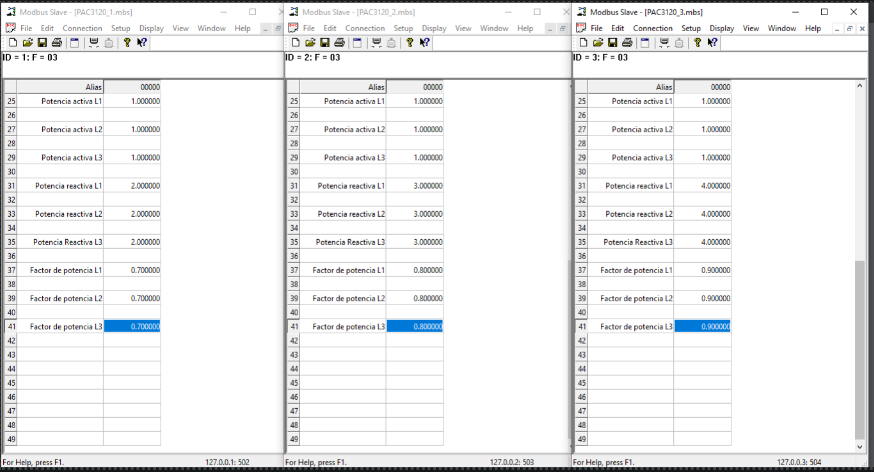

Luego, comenzamos con la configuración del Id de cada dispositivo y configuraciones Modbus, como se muestra en la imagen: 

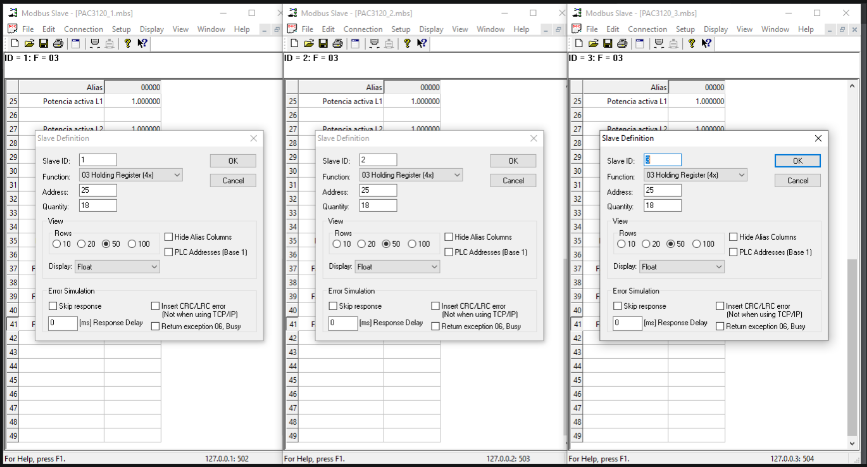

Posteriormente, comenzamos a conectar los equipos y para ello establecemos la dirección IP y los puertos de comunicación, como se muestra a continuación: 

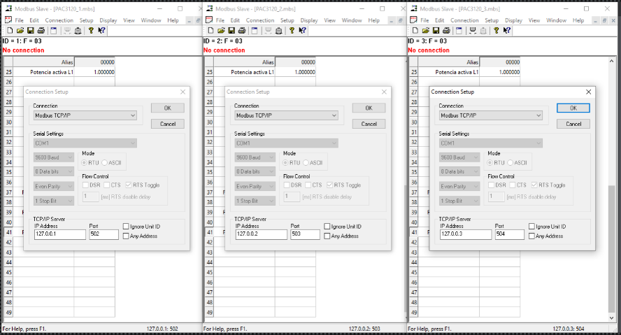

Finalmente damos clic en OK, y los dispositivos queda configurados y listos para leer en la aplicación desarrollada en Python. Así deben de lucir:

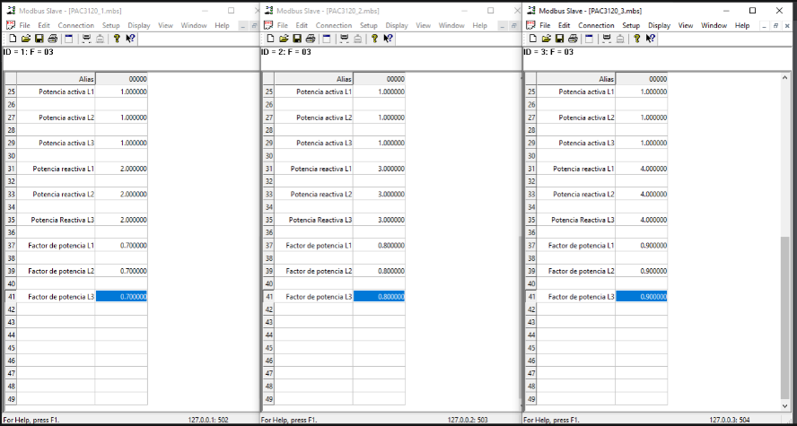

Por otra parte, en el proyecto o repositorio a un archivo llamado requirements donde esta información de librerías a instalar para poder usar la aplicación, también, está el archivo main.py que se debe ejecutar y la clase PAC3120.py, la cual es la instancia del medidor para obtener datos del programa Modbus Slave. Al ejecutar el archivo main.py se debe mostrar lo siguiente:

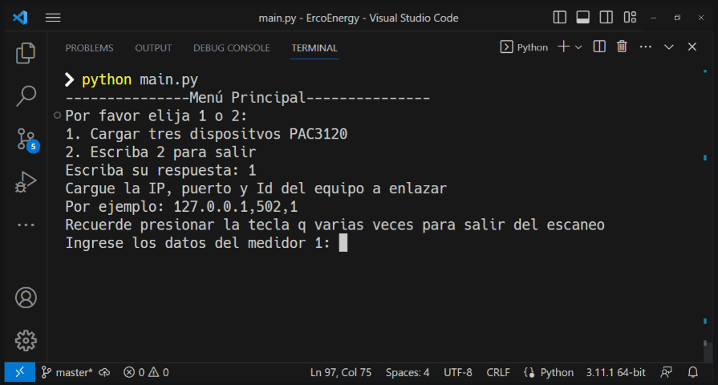

Donde se debe ingresar la opción 1 para cargar los dispositivos, luego se ingresa la dirección IP, puerto e Id de cada dispositivo configurado en Modbus Slave para comenzar con su lectura y obtener valore relevantes del medidor, esto se muestra a continuación: 

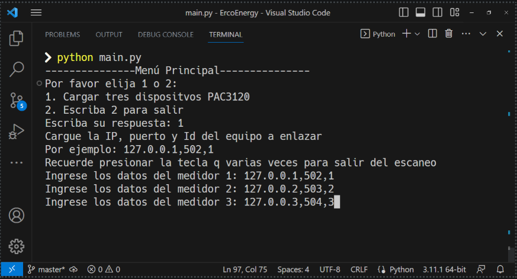
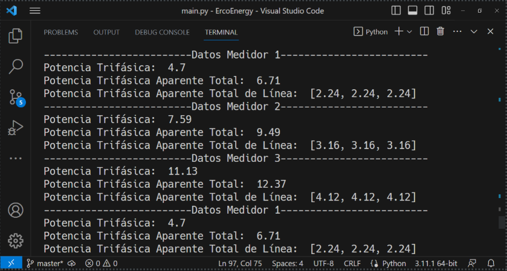

Cabe aclarar que estos datos se muestran cíclicamente con un periodo de un 1 segundo. Para salir se presiona varias veces la tecla q y este regresara al menú principal, como se muestra en la siguiente imagen: 

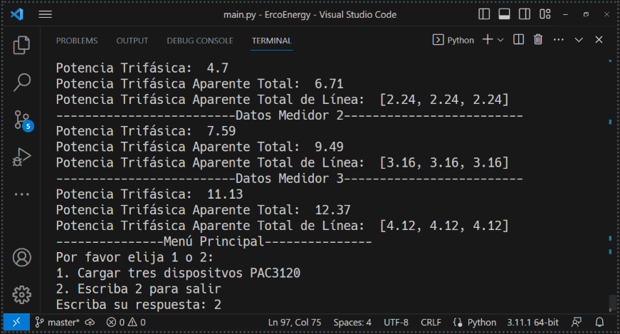

Por último, en caso de ingresar mal una dirección IP, puerto o id el sistema mostrará las falencias como se muestra a continuación: 

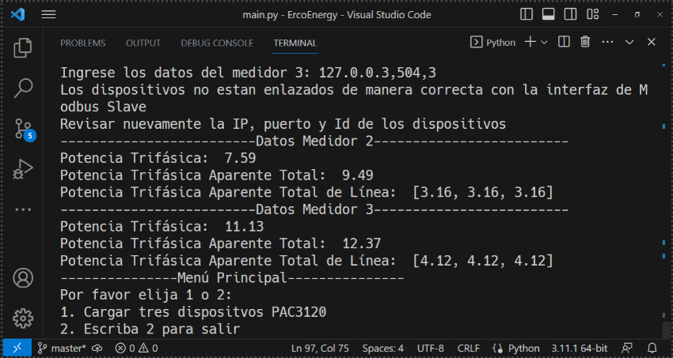

En la imagen anterior se observa que muestra un primer mapeo de los dispositivos que quedaron bien enlazados y en el que hubo un error muestra la advertencia y regresa al menú principal ya que todos deben quedar enlazados, lo mismo ocurre si se ingresa un Id diferente al establecido en Modbus Slave, esto se evidencia a continuación: 

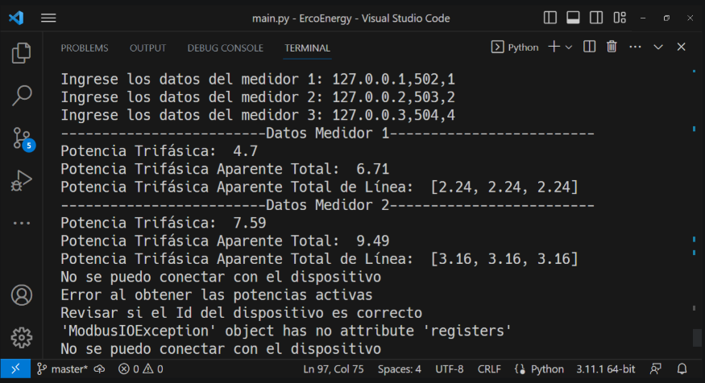